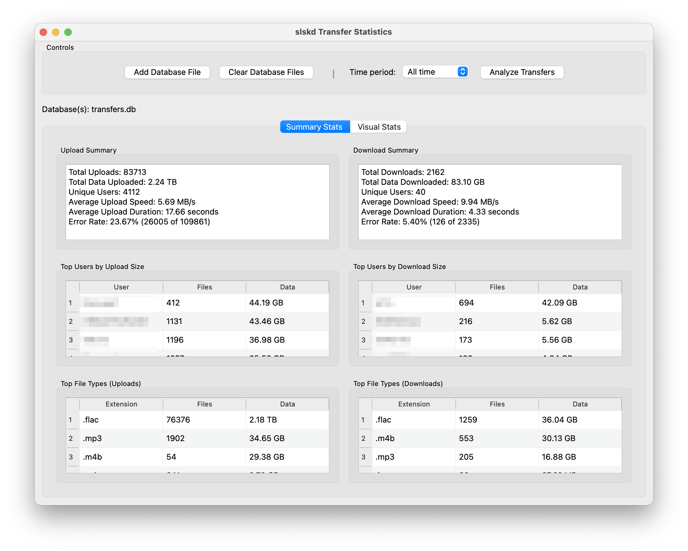
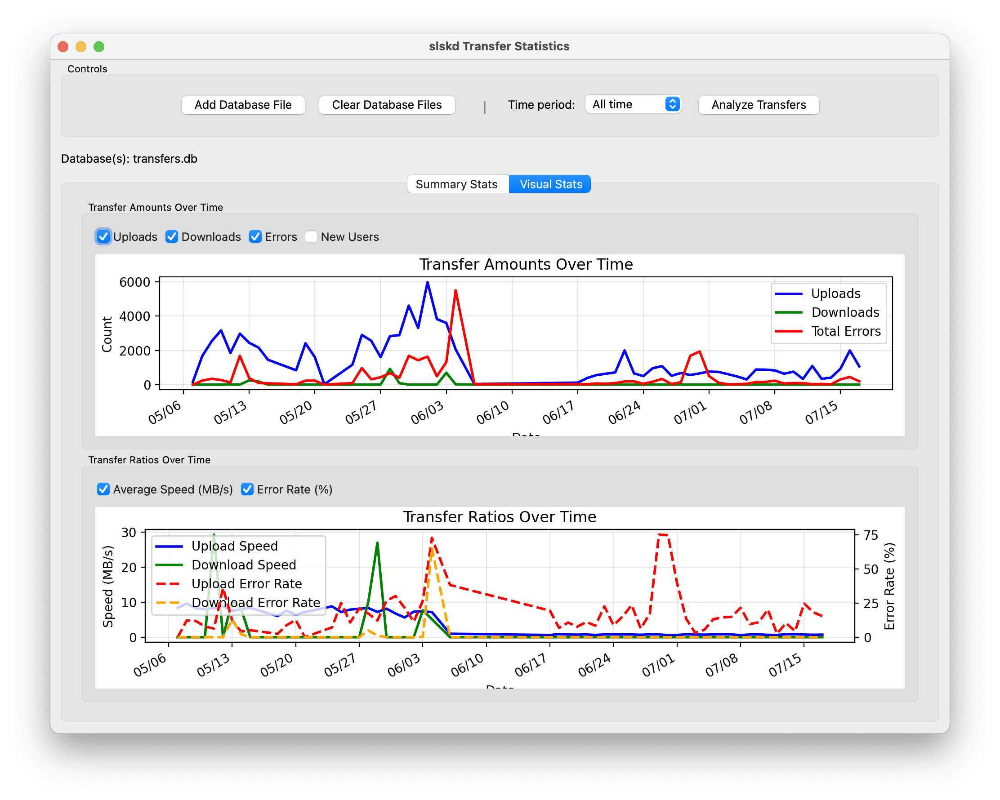

# slskd Transfer Statistics

A GUI tool to analyze upload and download statistics from your slskd transfers database.

## Features

- Analyzes uploads and downloads stored in the transfers.db database(s)
- Automatically finds and combines data from multiple database files
- Backwards compatible with both old and new database formats
- Calculates total transfers, data transferred, and unique users
- Shows average transfer speed and duration
- Lists top users by data transferred
- Shows statistics by file type
- Filter statistics by time period (All time, Last month, Last year)
- User-friendly graphical interface with summary and detailed tables

## Requirements

- Python 3.6+
- SQLite3
- PyQt5
- matplotlib
- mplcursors

## Installation

1. Clone or download this repository to your local machine
2. Install dependencies: `pip3 install PyQt5 matplotlib mplcursors`
3. Place your `transfers.db` file in the same directory as the script, or use the file browser to select database files

## Usage

```bash
# Launch the GUI application
python3 slskd_stats_gui.py
```

With the GUI, you can:
- Select one or more database files using the file browser
- Choose time period from dropdown (All time, Last month, Last year)
- Set the number of top entries to display
- View upload and download statistics side-by-side
- See summary statistics and detailed tables for users and file types
- **NEW**: Visual time series graphs showing transfer trends over time

## Screenshots

### Summary View


### Visual Stats with Time Series Graphs


## Database Compatibility

This tool automatically detects and works with both:
- **Old format**: Text-based `State` column
- **New format**: Integer `State` + `StateDescription` columns

## About

This tool is designed to work with the `transfers.db` SQLite database created by [slskd](https://github.com/slskd/slskd), a Soulseek client daemon. It helps you understand your sharing patterns and track transfer statistics.

## License

MIT